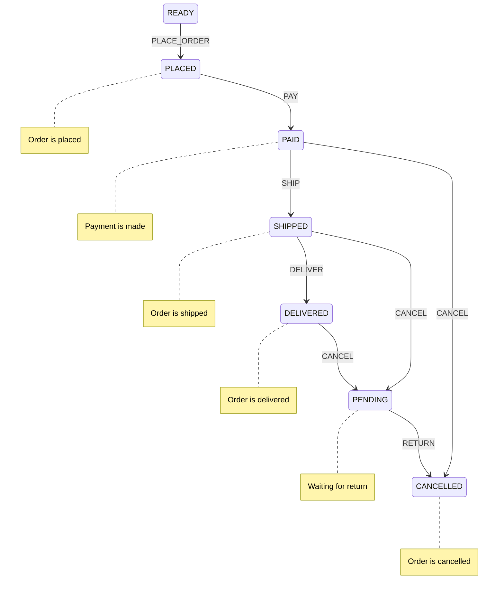

# state-machines

## Goals
- Event driven
- Determine allowed transitions
- Actions followed by state-change events
- In(source/entry) and Out(target/exit) actions per target state
- Guards
- Track the current state of machines
- Consistent state within the same machine

## Order State Diagram

